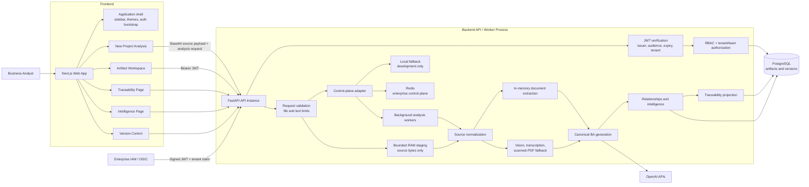
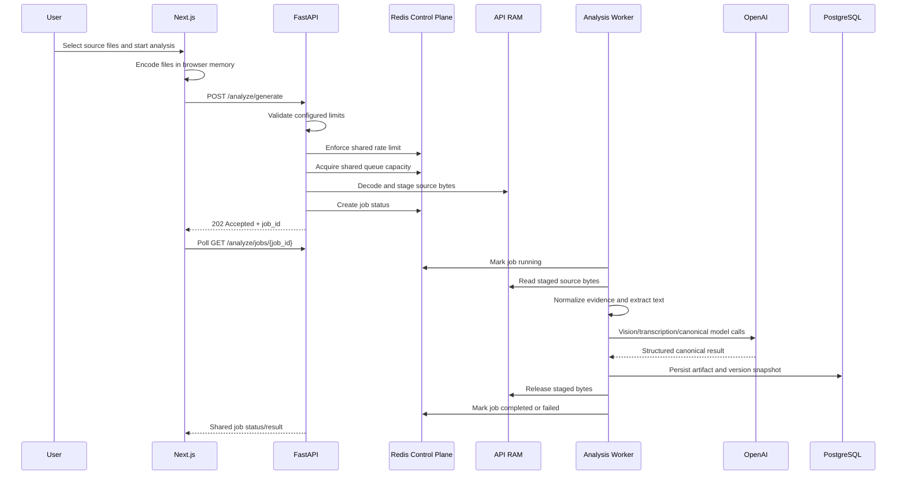

# BA Optimization High-Level Architecture

## Enterprise-Centric Target Implemented

The current implementation separates privacy-sensitive source handling from enterprise
coordination:

- Source-file bytes remain memory-only and are not persisted by the application.
- Redis, when configured, acts as the shared control plane for job state, rate limits, queue
  capacity, and stale-job detection.
- PostgreSQL stores durable business artifacts, canonical analysis JSON, metadata, and versions.
- OpenAI receives normalized evidence and modality-specific calls where needed.
- Hybrid authentication accepts locally signed JWTs and tenant-approved OIDC JWTs concurrently.
- Tenant, role, team, and project mappings determine authorization on every protected API request.



## Request Flow



## Component Responsibilities

| Component | Responsibility |
| --- | --- |
| Next.js app | Project navigation, new analysis, artifact workspace, phase wizard, sticky actions, intelligence, traceability, versions, login shell, and day/night theme. |
| FastAPI routes | Analysis generation/polling, artifact CRUD, refinement, exports, versions, compare, traceability, intelligence, auth bootstrap, and limit reporting. |
| Authentication | Hybrid local JWT and OIDC validation with issuer, audience, scope, tenant, and expiry enforcement; local refresh and one-time reset tokens. |
| Authorization | Tenant-scoped RBAC, custom roles, global-root override, team membership, project-team mappings, archive/restore controls, and `view_all_projects`. |
| Identity lifecycle | Local and SSO users coexist with password policy, expiry, status, onboarding email, provider sync, and local-email collision protection. |
| Tenant registry | Global root creates organizations; tenant IDs scope identity uniqueness, teams, mappings, artifacts, versions, reset tokens, providers, and settings. |
| Team governance | Projects may have multiple teams; each team independently controls whether it may span multiple projects. Membership grants project access. |
| Control plane | Shared job metadata, queue capacity, stale-job detection, and rate limiting. Uses Redis in enterprise deployments and local memory for development fallback. |
| RAM staging | Holds uploaded source bytes briefly in the accepting API process. Enforces total memory budget and TTL. |
| Source normalization | Converts supported documents, images, audio, and scanned PDFs into deterministic evidence with hashes, extraction method, and source references. |
| Canonical analysis | Produces CBAKF semantic entities, relationships, requirements, process/test/impact intelligence, executive translation, and enterprise controls. |
| Traceability service | Builds delivery-focused traceability and reports existing projects only when same-type canonical entities have meaningful semantic overlap, with source and relationship evidence. |
| PostgreSQL | Persists artifacts, canonical JSON, source metadata, intelligence edits, and version snapshots. |
| OpenAI APIs | Performs modality extraction and structured canonical BA generation. |

## Persistence Boundaries

Persisted:

- Project and artifact metadata.
- Canonical analysis JSON.
- Artifact versions and restore metadata.
- Source-file metadata: name, MIME type, size, hash, extraction status, and source reference.
- Intelligence edits and versioned comparison data.
- Job status/result metadata while retained by the control plane.
- Tenant settings, users, roles, identity providers, team memberships, and project-team mappings.
- Organization registry plus tenant lineage on artifacts, versions, memberships, mappings, and reset tokens.
- Hashed local passwords and hashed one-time reset tokens; plaintext passwords are never persisted.

Not persisted by the application:

- Uploaded file bytes.
- Raw Base64 payloads.
- Raw audio/video/PDF/DOCX source files.
- Temporary modality payloads.

## Enterprise Runtime Configuration

`.env.example` documents the configuration contract. `.env` contains local secrets and must not be
committed.

Recommended enterprise settings:

```env
REDIS_URL=redis://redis:6379/0
ANALYSIS_REQUIRE_REDIS=true
ANALYSIS_MAX_CONCURRENT_JOBS=2
ANALYSIS_MAX_QUEUED_JOBS=20
ANALYSIS_RATE_LIMIT_REQUESTS=10
ANALYSIS_RATE_LIMIT_WINDOW_SECONDS=60
ANALYSIS_JOB_STALE_SECONDS=7200
ANALYSIS_MAX_STAGED_MEMORY_BYTES=134217728
```

`AUTH_MODE=hybrid` keeps local break-glass administration available while allowing trusted OIDC
providers configured per tenant. Every protected route requires a bearer JWT; login, password
reset, and the health/root endpoint are intentional public boundaries.

Local login includes an organization ID. Uniqueness for usernames, email addresses, role names,
team slugs, and provider issuers is scoped by tenant so independently onboarded organizations do
not collide. The global root is the only identity allowed to create organization records.

## Local Redis Setup

The project root includes `docker-compose.yml` with a local Redis service configured for
coordination-only usage. It disables Redis persistence so local testing matches the intended
no-source-file-storage posture.

Start Redis from the backend directory:

```bash
docker compose -f docker-compose.redis.yml up -d redis
```

On macOS without Docker, use Homebrew:

```bash
brew install redis
brew services start redis
```

The backend `.env` should point to the local service:

```env
REDIS_URL=redis://localhost:6379/0
ANALYSIS_REQUIRE_REDIS=false
```

Verify Redis-backed coordination from the backend directory:

```bash
redis-cli ping
venv/bin/python scripts/check_redis_control_plane.py
```

For stricter enterprise-mode testing, set `ANALYSIS_REQUIRE_REDIS=true`; the backend will then fail
fast instead of falling back to local memory when Redis is unavailable.

## Current Scalability Profile

| Area | Current enterprise posture |
| --- | --- |
| Job status polling | Shared across API instances when Redis is enabled. |
| Rate limiting | Shared Redis token-window counters when Redis is enabled. |
| Queue capacity | Shared Redis active-job capacity when Redis is enabled. |
| Source bytes | Memory-only and process-local by design. |
| API horizontal scaling | Supported for status/rate/capacity; in-flight bytes remain tied to the accepting instance. |
| Worker crash behavior | In-flight memory-only bytes are lost; job becomes failed after stale timeout. |
| Durable artifacts | Stored in PostgreSQL. |
| Production IAM | Trusted OIDC JWT validation and directory synchronization are implemented; provider-specific SSO initiation remains an integration concern. |
| Tenant isolation | Enforced in identity, settings, teams, project access, archive/restore, traceability context, and analysis jobs. |
| Project authorization | Owners and assigned-team members see projects; `view_all_projects` and global root provide governed overrides. |

## Remaining Enterprise Upgrades

- Add provider-specific authorization-code/PKCE sign-in initiation; API-side OIDC JWT validation is already implemented.
- Add SCIM provisioning where supported; the generic batch synchronization endpoint remains available.
- Add durable audit-event tables for user actions, approvals, exports, and version restores.
- Add worker heartbeat details and richer progress events.
- For very large media, add a private direct-to-worker streaming channel so API instances do not
  hold request payloads longer than necessary.
- Add deployment-level memory guards and request-size limits at the reverse proxy.
- Add centralized observability: traces, metrics, structured logs, alerts, and OpenAI cost/token
  telemetry.
