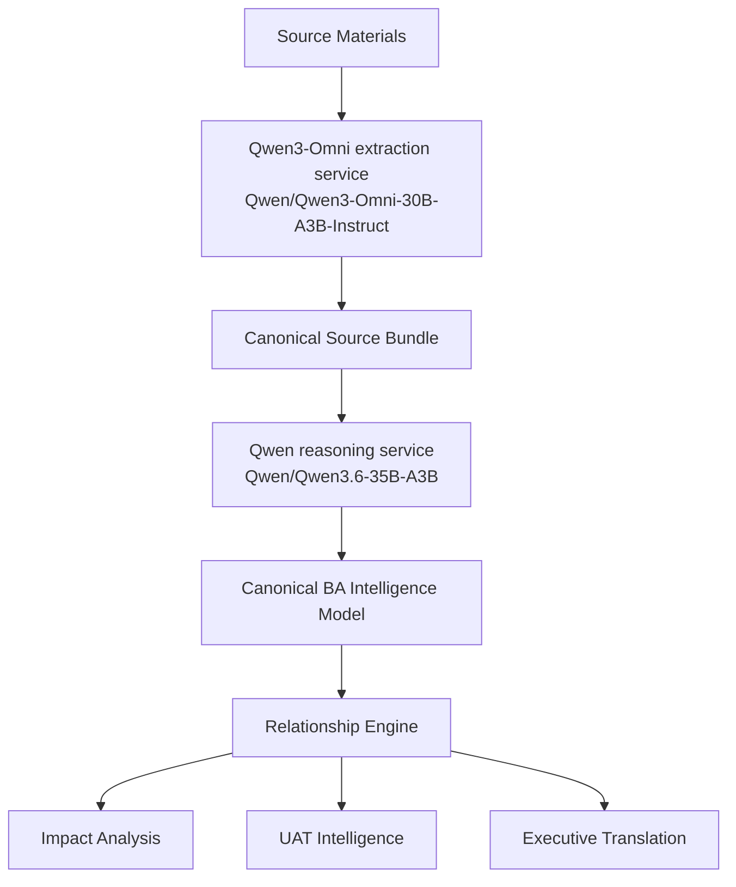

# Local Qwen Model Runtime

This app supports a user-selected local model profile for enterprise data privacy.
The frontend exposes this as **Private local Qwen** or **Hybrid private extraction**
when creating a new project analysis.

## Runtime Shape



## Configuration

Set these variables in `.env` when local model analysis is enabled:

```bash
LOCAL_QWEN_REASONING_BASE_URL=http://localhost:8001/v1
LOCAL_QWEN_EXTRACTION_BASE_URL=http://localhost:8002/v1
LOCAL_QWEN_API_KEY=replace-with-generated-local-model-key
LOCAL_QWEN_REASONING_MODEL=Qwen/Qwen3.6-35B-A3B
LOCAL_QWEN_EXTRACTION_MODEL=Qwen/Qwen3-Omni-30B-A3B-Instruct
LOCAL_QWEN_MODEL_DIR=./models/qwen
```

Generate the internal model API key locally:

```bash
cd backend
./scripts/generate_local_model_api_key.sh
```

Store the generated `LOCAL_QWEN_API_KEY` in the private `.env` file only. The
browser must never call local model endpoints directly; only the backend should
hold this key and call the model services.

## Download Model Files

The download script uses Hugging Face model IDs directly:

- `Qwen/Qwen3-Omni-30B-A3B-Instruct`
- `Qwen/Qwen3.6-35B-A3B`

Run:

```bash
cd backend
./scripts/install_local_qwen_models.sh
```

These Qwen model repositories are public and do not require `HF_TOKEN`,
Hugging Face login, or an interactive license agreement for the default
download path.

Current Hugging Face metadata reports approximately:

- `Qwen/Qwen3-Omni-30B-A3B-Instruct`: 70.5 GB repository storage
- `Qwen/Qwen3.6-35B-A3B`: 71.9 GB repository storage

Plan for at least 170 GB of free model-cache disk before downloading both.
Set `LOCAL_QWEN_MODEL_DIR` to an external, server, or mounted enterprise model
volume when the application disk is too small.

## Start Local Services

The local runtime uses OpenAI-compatible vLLM endpoints:

```bash
cd backend
docker compose -f docker-compose.local-models.yml --profile local-models up -d
```

Expected endpoints:

- Reasoning: `http://localhost:8001/v1`
- Extraction: `http://localhost:8002/v1`

Both services require `Authorization: Bearer $LOCAL_QWEN_API_KEY`. The Compose
file fails closed if the key is missing.

The backend uses these endpoints when the user selects **Private local Qwen**.
The **Hybrid private extraction** profile sends multimodal extraction to local
Qwen and keeps reasoning on the hosted model configured by `OPENAI_MODEL`.

## Data Handling

Raw uploaded source bytes remain in the app's bounded ephemeral upload cache
while analysis is running. The persisted artifact stores canonical outputs,
source names, source codes, extraction status, and content fingerprints. It
does not persist the original raw upload payload as a document repository.

## Capacity Notes

These models are large enterprise workloads. Plan GPU memory, model cache disk,
startup time, and concurrency before enabling them for multiple users. Keep
`ANALYSIS_MAX_CONCURRENT_JOBS`, `ANALYSIS_MAX_QUEUED_JOBS`, and rate limits
conservative until the local inference servers are sized and monitored.
